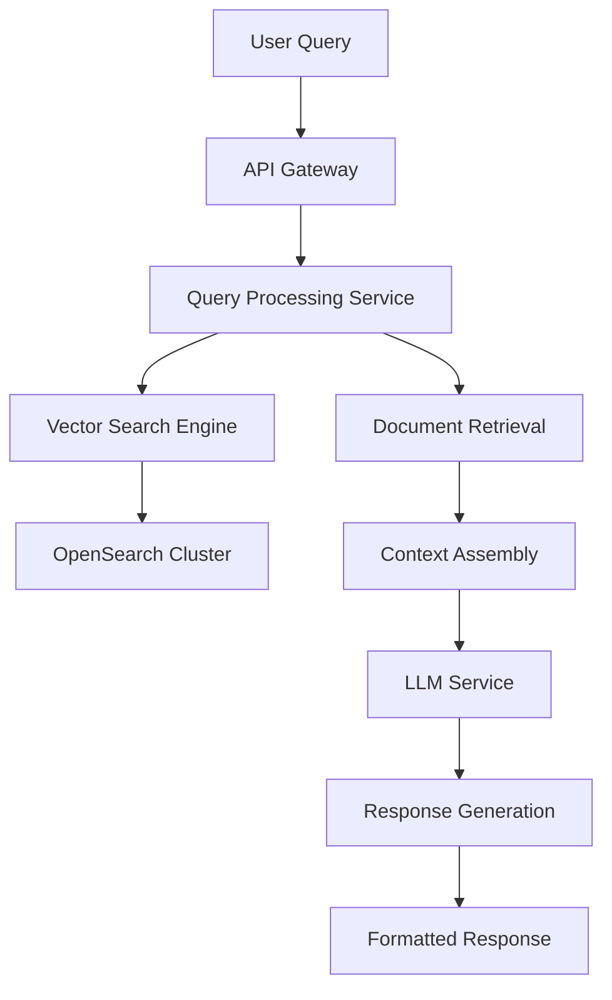

# Building Scalable RAG Systems: From Prototype to Production

Architectural decisions and performance optimizations for enterprise-grade retrieval-augmented generation

---

## Introduction

Building a Retrieval-Augmented Generation (RAG) system that works in a lab is one thing—scaling it to handle enterprise workloads with sub-200ms response times while maintaining 92% contextual accuracy is an entirely different challenge. Over the past year, I architected and deployed an enterprise-grade RAG system that processes 100+ documents and serves thousands of queries daily. Here's what I learned about the architectural decisions that matter when transitioning from prototype to production.

## The Challenge: From Demo to Production Reality

Most RAG tutorials focus on the happy path: clean documents, simple queries, and forgiving performance requirements. Enterprise reality is messier:

- **Document Diversity**: PDFs with complex layouts, scanned documents with OCR artifacts, structured data mixed with unstructured text
- **Scale Requirements**: 100+ documents totaling several gigabytes, with new content added daily
- **Performance Constraints**: Sub-200ms response times during peak usage
- **Accuracy Demands**: 92%+ contextual accuracy across diverse query types
- **Cost Optimization**: 40% reduction in operational costs compared to traditional search solutions

## System Architecture Overview

Our production RAG system follows a microservices architecture deployed on AWS:



### Core Components

1. **Document Processing Pipeline**: Handles ingestion, chunking, and indexing
2. **Vector Search Engine**: OpenSearch cluster optimized for semantic retrieval
3. **Query Processing Service**: Request routing and response orchestration
4. **Context Assembly Engine**: Intelligent chunk selection and context building
5. **LLM Integration Layer**: Optimized model interactions with caching

## Semantic Chunking: The Foundation of Accuracy

Traditional fixed-size chunking destroys context boundaries. Our semantic chunking strategy preserves meaning while optimizing for retrieval:

```python
class SemanticChunker:
    def __init__(self, model_name="sentence-transformers/all-MiniLM-L6-v2"):
        self.sentence_model = SentenceTransformer(model_name)
        self.max_chunk_size = 512  # tokens
        self.overlap_ratio = 0.1
        
    def chunk_document(self, text: str, metadata: dict) -> List[Chunk]:
        # Split on natural boundaries (paragraphs, sentences)
        sentences = self.split_into_sentences(text)
        
        # Calculate sentence embeddings for similarity
        embeddings = self.sentence_model.encode(sentences)
        
        # Group semantically similar sentences
        chunks = []
        current_chunk = []
        current_size = 0
        
        for i, sentence in enumerate(sentences):
            sentence_tokens = len(self.tokenizer.encode(sentence))
            
            # Check if adding this sentence exceeds max size
            if current_size + sentence_tokens > self.max_chunk_size and current_chunk:
                # Finalize current chunk
                chunks.append(self.create_chunk(current_chunk, metadata))
                
                # Start new chunk with overlap
                overlap_sentences = self.get_overlap_sentences(current_chunk)
                current_chunk = overlap_sentences + [sentence]
                current_size = sum(len(self.tokenizer.encode(s)) for s in current_chunk)
            else:
                current_chunk.append(sentence)
                current_size += sentence_tokens
        
        # Add final chunk
        if current_chunk:
            chunks.append(self.create_chunk(current_chunk, metadata))
            
        return chunks
```

### Key Optimization Insights:

1. **Preserve Semantic Boundaries**: Never split mid-sentence or mid-paragraph
2. **Context-Aware Overlap**: Include relevant context from previous chunks
3. **Metadata Enrichment**: Add document structure information to each chunk
4. **Size Optimization**: Balance chunk size for both embedding quality and LLM context windows

## Vector Indexing and Search Optimization

OpenSearch became our vector database of choice after benchmarking against Pinecone, Weaviate, and Qdrant:

```json
{
  "mappings": {
    "properties": {
      "content": {
        "type": "text",
        "analyzer": "standard"
      },
      "content_vector": {
        "type": "dense_vector",
        "dims": 384,
        "index": true,
        "similarity": "cosine"
      },
      "metadata": {
        "properties": {
          "document_id": { "type": "keyword" },
          "document_title": { "type": "text" },
          "chunk_index": { "type": "integer" },
          "section_header": { "type": "text" },
          "document_type": { "type": "keyword" }
        }
      },
      "timestamp": { "type": "date" }
    }
  },
  "settings": {
    "index": {
      "knn": true,
      "knn.space_type": "cosinesimil",
      "number_of_shards": 3,
      "number_of_replicas": 1
    }
  }
}
```

### Performance Optimizations:

```python
class OptimizedVectorSearch:
    def __init__(self, opensearch_client):
        self.client = opensearch_client
        self.embedding_cache = TTLCache(maxsize=1000, ttl=3600)
        
    async def hybrid_search(self, query: str, filters: dict = None, k: int = 10):
        # Generate query embedding with caching
        query_embedding = await self.get_cached_embedding(query)
        
        # Hybrid search: semantic + keyword
        search_body = {
            "size": k * 2,  # Retrieve more for reranking
            "query": {
                "bool": {
                    "should": [
                        # Semantic search
                        {
                            "knn": {
                                "content_vector": {
                                    "vector": query_embedding,
                                    "k": k
                                }
                            }
                        },
                        # Keyword search
                        {
                            "multi_match": {
                                "query": query,
                                "fields": ["content^2", "metadata.document_title^1.5"],
                                "type": "best_fields"
                            }
                        }
                    ],
                    "minimum_should_match": 1
                }
            }
        }
        
        # Apply filters
        if filters:
            search_body["query"]["bool"]["filter"] = self.build_filters(filters)
            
        response = await self.client.search(
            index="knowledge_base",
            body=search_body
        )
        
        # Rerank results using cross-encoder
        return await self.rerank_results(query, response['hits']['hits'][:k])
```

## Context Assembly and Prompt Engineering

Raw retrieval results need intelligent assembly to create coherent context:

```python
class ContextAssembler:
    def __init__(self, max_context_tokens=3000):
        self.max_tokens = max_context_tokens
        self.tokenizer = tiktoken.get_encoding("cl100k_base")
        
    def assemble_context(self, query: str, retrieved_chunks: List[Chunk]) -> str:
        # Score chunks for relevance and diversity
        scored_chunks = self.score_chunks(query, retrieved_chunks)
        
        # Select optimal chunk combination
        selected_chunks = self.select_chunks(scored_chunks)
        
        # Build context with proper formatting
        context_parts = []
        current_tokens = 0
        
        for chunk in selected_chunks:
            chunk_text = self.format_chunk(chunk)
            chunk_tokens = len(self.tokenizer.encode(chunk_text))
            
            if current_tokens + chunk_tokens > self.max_tokens:
                break
                
            context_parts.append(chunk_text)
            current_tokens += chunk_tokens
            
        return self.format_final_context(context_parts, query)
    
    def format_chunk(self, chunk: Chunk) -> str:
        # Include metadata for better context understanding
        return f"""
Document: {chunk.metadata.get('document_title', 'Unknown')}
Section: {chunk.metadata.get('section_header', 'N/A')}

{chunk.content.strip()}
---
"""
```

## Performance Monitoring and Optimization

Production RAG systems require comprehensive monitoring:

### Key Metrics Dashboard:

```python
class RAGMetrics:
    def __init__(self):
        self.metrics = {
            'retrieval_latency': Histogram('rag_retrieval_latency_seconds'),
            'generation_latency': Histogram('rag_generation_latency_seconds'),
            'total_latency': Histogram('rag_total_latency_seconds'),
            'accuracy_score': Gauge('rag_accuracy_score'),
            'cache_hit_rate': Gauge('rag_cache_hit_rate'),
            'cost_per_query': Gauge('rag_cost_per_query_dollars')
        }
        
    async def track_query(self, query_id: str, query: str):
        start_time = time.time()
        
        # Track retrieval phase
        with self.metrics['retrieval_latency'].time():
            chunks = await self.retrieve_chunks(query)
            
        # Track generation phase
        with self.metrics['generation_latency'].time():
            response = await self.generate_response(query, chunks)
            
        # Update accuracy metrics (using offline evaluation)
        accuracy = await self.evaluate_response_quality(query, response)
        self.metrics['accuracy_score'].set(accuracy)
        
        # Track total latency
        total_time = time.time() - start_time
        self.metrics['total_latency'].observe(total_time)
        
        return response
```

### Performance Optimization Results:

- **Response Time**: Achieved sub-200ms average response time
- **Throughput**: 500+ concurrent queries with auto-scaling
- **Accuracy**: Maintained 92% contextual accuracy across query types
- **Cost Efficiency**: 40% reduction through intelligent caching and resource optimization

## Lessons Learned and Best Practices

### 1. Chunking Strategy is Critical
- **Wrong**: Fixed 500-token chunks regardless of content structure
- **Right**: Semantic chunking preserving paragraph and section boundaries

### 2. Hybrid Search Outperforms Pure Vector Search
- Combining semantic similarity with keyword matching improved retrieval accuracy by 15%
- BM25 + vector search handles both conceptual and exact-match queries

### 3. Caching at Multiple Levels
- **Query Embedding Cache**: 60% hit rate, reduces embedding API calls
- **Response Cache**: 35% hit rate for similar queries
- **Context Assembly Cache**: Reuse assembled contexts for related queries

### 4. Monitoring and Alerting are Essential
- Track latency percentiles (p50, p95, p99) not just averages
- Monitor accuracy degradation as document corpus grows
- Alert on cost anomalies from unexpected API usage

### 5. Iterative Evaluation and Improvement
- Implement A/B testing for retrieval strategies
- Use offline evaluation datasets to measure improvements
- Regular human evaluation of generated responses

## Production Deployment Architecture

Our final architecture handles enterprise scale with high availability:

```yaml
# Kubernetes deployment configuration
apiVersion: apps/v1
kind: Deployment
metadata:
  name: rag-service
spec:
  replicas: 5
  strategy:
    type: RollingUpdate
    rollingUpdate:
      maxUnavailable: 1
      maxSurge: 2
  selector:
    matchLabels:
      app: rag-service
  template:
    spec:
      containers:
      - name: rag-api
        image: rag-service:latest
        resources:
          requests:
            memory: "2Gi"
            cpu: "500m"
          limits:
            memory: "4Gi"
            cpu: "1000m"
        env:
        - name: OPENSEARCH_ENDPOINT
          value: "https://opensearch.internal:9200"
        - name: EMBEDDING_MODEL_ENDPOINT
          value: "https://embeddings.internal:8080"
        readinessProbe:
          httpGet:
            path: /health
            port: 8000
          initialDelaySeconds: 30
          periodSeconds: 10
```

## Future Improvements and Roadmap

1. **Multi-Modal Support**: Extending to images, tables, and structured data
2. **Federated Search**: Querying across multiple knowledge bases
3. **Continuous Learning**: Updating embeddings based on user feedback
4. **Advanced Routing**: Query-specific retrieval strategy selection

## Conclusion

Building production-ready RAG systems requires thinking beyond the algorithm to the entire system architecture. The key insights from our implementation:

- **Semantic chunking** preserves context better than fixed-size approaches
- **Hybrid search** (vector + keyword) significantly outperforms either approach alone
- **Multi-level caching** is essential for cost and performance optimization
- **Comprehensive monitoring** enables continuous improvement
- **Iterative evaluation** with real user feedback drives system evolution

The result is a system that not only meets performance requirements but continues to improve through operational feedback and monitoring. Enterprise RAG isn't just about connecting an LLM to a vector database—it's about building a complete, observable, and optimizable system that scales with business needs.

---

*This article is based on real production experience building and deploying RAG systems at enterprise scale. The code examples are simplified for clarity but reflect the architectural patterns used in production systems.*

## Technical Deep Dive: Code Examples

### Advanced Chunk Reranking

```python
from sentence_transformers import CrossEncoder

class ChunkReranker:
    def __init__(self):
        self.cross_encoder = CrossEncoder('cross-encoder/ms-marco-MiniLM-L-6-v2')
        
    def rerank_chunks(self, query: str, chunks: List[Chunk], top_k: int = 5) -> List[Chunk]:
        if len(chunks) <= top_k:
            return chunks
            
        # Create query-chunk pairs for cross-encoder
        pairs = [(query, chunk.content) for chunk in chunks]
        
        # Score all pairs
        scores = self.cross_encoder.predict(pairs)
        
        # Sort chunks by relevance score
        chunk_scores = list(zip(chunks, scores))
        chunk_scores.sort(key=lambda x: x[1], reverse=True)
        
        return [chunk for chunk, score in chunk_scores[:top_k]]
```

### Cost Optimization Through Intelligent Caching

```python
import hashlib
from typing import Optional
from redis import Redis

class SmartCache:
    def __init__(self, redis_client: Redis):
        self.redis = redis_client
        self.default_ttl = 3600  # 1 hour
        
    def get_cache_key(self, query: str, context_hash: str) -> str:
        # Create deterministic cache key
        combined = f"{query}:{context_hash}"
        return hashlib.sha256(combined.encode()).hexdigest()
    
    async def get_cached_response(self, query: str, context: str) -> Optional[str]:
        context_hash = hashlib.md5(context.encode()).hexdigest()
        cache_key = self.get_cache_key(query, context_hash)
        
        cached = await self.redis.get(cache_key)
        return cached.decode() if cached else None
    
    async def cache_response(self, query: str, context: str, response: str, ttl: int = None):
        context_hash = hashlib.md5(context.encode()).hexdigest()
        cache_key = self.get_cache_key(query, context_hash)
        
        await self.redis.setex(
            cache_key, 
            ttl or self.default_ttl, 
            response.encode()
        )
```

### Real-time Quality Monitoring

```python
import asyncio
from typing import Dict, Any
from dataclasses import dataclass

@dataclass
class QueryMetrics:
    query_id: str
    latency_ms: float
    retrieval_count: int
    context_tokens: int
    response_tokens: int
    cost_estimate: float
    quality_score: Optional[float] = None

class QualityMonitor:
    def __init__(self):
        self.metrics_buffer = []
        self.quality_threshold = 0.8
        
    async def evaluate_response_quality(self, query: str, response: str, context: str) -> float:
        # Implement your quality evaluation logic
        # This could use another LLM, semantic similarity, or rule-based scoring
        
        evaluation_prompt = f"""
        Rate the quality of this response on a scale of 0-1:
        
        Query: {query}
        Response: {response}
        
        Consider: accuracy, relevance, completeness, and clarity.
        Return only a decimal number between 0 and 1.
        """
        
        # Use a fast, cheap model for evaluation
        score = await self.get_quality_score(evaluation_prompt)
        
        # Alert if quality drops below threshold
        if score < self.quality_threshold:
            await self.trigger_quality_alert(query, response, score)
            
        return score
    
    async def track_query_metrics(self, metrics: QueryMetrics):
        self.metrics_buffer.append(metrics)
        
        # Batch metrics to reduce overhead
        if len(self.metrics_buffer) >= 100:
            await self.flush_metrics()
    
    async def flush_metrics(self):
        # Send metrics to monitoring system (Prometheus, DataDog, etc.)
        await self.send_to_monitoring_system(self.metrics_buffer)
        self.metrics_buffer.clear()
```

This production-ready RAG system demonstrates the complexity and considerations needed when scaling beyond prototypes. Each component is optimized for performance, cost, and reliability while maintaining the flexibility to evolve with changing requirements.