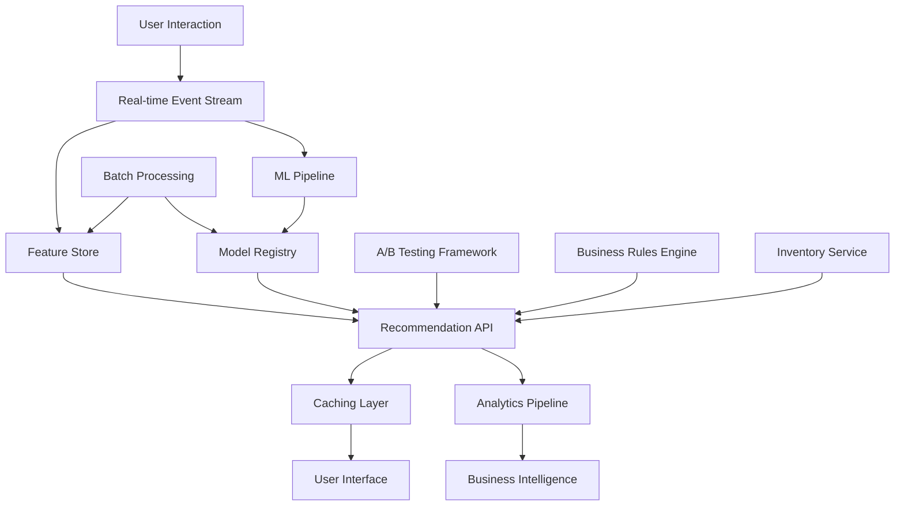

# E-commerce Recommendation Systems: Beyond the Algorithm

System design, scalability, and business impact measurement for recommendation engines

---

## Introduction

Building a recommendation system that improves user engagement by 25% isn't just about implementing collaborative filtering or matrix factorization. It's about architecting a complete system that handles millions of user interactions, serves recommendations in real-time, and continuously adapts to changing user preferences while measuring business impact. During my internship at Eth Tech, I built such a system for an e-commerce platform handling 10,000+ concurrent users, learning that production recommendation systems are as much about infrastructure and business intelligence as they are about machine learning algorithms.

This article goes beyond the algorithm to explore the complete system design, from real-time data pipelines to A/B testing frameworks, that makes e-commerce recommendations successful at scale.

## The Complete E-commerce Recommendation Challenge

Academic recommendation tutorials focus on offline accuracy metrics like RMSE or precision@k. Production e-commerce systems face different challenges:

### Business Requirements
- **Revenue Impact**: Recommendations must drive actual purchases, not just clicks
- **User Experience**: Sub-200ms response times during peak shopping periods
- **Inventory Integration**: Recommend products that are actually available and profitable
- **Seasonal Adaptability**: Handle holiday shopping spikes and trend changes
- **Personalization at Scale**: Unique recommendations for millions of users

### Technical Constraints
- **Real-time Processing**: User behavior changes must reflect in recommendations immediately
- **Cold Start Problem**: Recommend to new users and promote new products effectively
- **Data Sparsity**: Most users interact with tiny fraction of product catalog
- **Scalability**: Handle Black Friday traffic spikes without degradation
- **Cost Optimization**: Balance recommendation quality with computational costs

### Success Metrics
- **Engagement**: 25% improvement in click-through rates
- **Conversion**: 15% increase in purchase conversion from recommendations
- **Performance**: Sub-200ms API response times
- **Scale**: Support 10,000+ concurrent users during peak periods

## System Architecture: Beyond the Algorithm

### High-Level Architecture



### Core Components Deep Dive

```python
from typing import Dict, List, Optional, Tuple, Any
from dataclasses import dataclass
from enum import Enum
import numpy as np
import redis
import asyncio
from datetime import datetime, timedelta
import logging

class InteractionType(Enum):
    VIEW = "view"
    CART_ADD = "cart_add"
    PURCHASE = "purchase"
    RATING = "rating"
    SEARCH = "search"
    WISHLIST = "wishlist"

@dataclass
class UserInteraction:
    user_id: str
    item_id: str
    interaction_type: InteractionType
    timestamp: datetime
    session_id: str
    context: Dict[str, Any]  # page, category, campaign, etc.
    value: Optional[float] = None  # rating, price, quantity

@dataclass
class RecommendationRequest:
    user_id: str
    context: Dict[str, Any]
    num_recommendations: int
    recommendation_type: str  # 'homepage', 'product_page', 'cart', etc.
    exclude_items: List[str] = None

@dataclass  
class Recommendation:
    item_id: str
    score: float
    confidence: float
    explanation: str
    business_score: float  # revenue potential, margin, inventory

class RealTimeFeatureStore:
    """Maintains up-to-date user and item features for recommendations"""
    
    def __init__(self, redis_client: redis.Redis):
        self.redis = redis_client
        self.feature_ttl = 3600  # 1 hour default TTL
        self.logger = logging.getLogger(__name__)
        
    async def update_user_features(self, user_id: str, interaction: UserInteraction):
        """Update user features based on new interaction"""
        
        # Get current user features
        current_features = await self.get_user_features(user_id)
        
        # Update interaction history
        await self.update_interaction_history(user_id, interaction)
        
        # Update computed features
        updated_features = await self.compute_updated_user_features(
            user_id, current_features, interaction
        )
        
        # Store updated features
        await self.store_user_features(user_id, updated_features)
        
        # Trigger real-time model updates if significant change
        if self.is_significant_change(current_features, updated_features):
            await self.trigger_model_update(user_id, updated_features)
    
    async def get_user_features(self, user_id: str) -> Dict[str, Any]:
        """Retrieve user features for recommendation generation"""
        
        # Try cache first
        cached_features = await self.redis.hgetall(f"user_features:{user_id}")
        if cached_features:
            return self.deserialize_features(cached_features)
        
        # Compute features from interaction history
        features = await self.compute_user_features_from_history(user_id)
        
        # Cache for future use
        await self.store_user_features(user_id, features)
        
        return features
    
    async def compute_user_features_from_history(self, user_id: str) -> Dict[str, Any]:
        """Compute comprehensive user features from interaction history"""
        
        # Get recent interactions (last 30 days)
        interactions = await self.get_user_interactions(user_id, days=30)
        
        if not interactions:
            return self.get_default_user_features()
        
        features = {
            # Behavioral features
            'total_interactions': len(interactions),
            'purchase_frequency': self.compute_purchase_frequency(interactions),
            'avg_session_length': self.compute_avg_session_length(interactions),
            'preferred_categories': self.compute_category_preferences(interactions),
            'price_sensitivity': self.compute_price_sensitivity(interactions),
            'brand_loyalty': self.compute_brand_loyalty(interactions),
            
            # Temporal features
            'active_hours': self.compute_active_hours(interactions),
            'shopping_days': self.compute_shopping_days(interactions),
            'recency_score': self.compute_recency_score(interactions),
            
            # Context features
            'device_preferences': self.compute_device_preferences(interactions),
            'channel_preferences': self.compute_channel_preferences(interactions),
            
            # Derived features for ML models
            'user_embedding': await self.compute_user_embedding(user_id, interactions),
            'lifecycle_stage': self.classify_user_lifecycle_stage(interactions),
            'churn_risk': await self.compute_churn_risk(user_id, interactions)
        }
        
        return features
    
    async def get_item_features(self, item_id: str) -> Dict[str, Any]:
        """Get comprehensive item features for recommendation scoring"""
        
        # Try cache first
        cached_features = await self.redis.hgetall(f"item_features:{item_id}")
        if cached_features:
            return self.deserialize_features(cached_features)
        
        # Compute features from product data and interaction history
        features = await self.compute_item_features(item_id)
        
        # Cache with shorter TTL (items change less frequently than users)
        await self.redis.hsetall(
            f"item_features:{item_id}",
            self.serialize_features(features),
            ex=7200  # 2 hours
        )
        
        return features
    
    async def compute_item_features(self, item_id: str) -> Dict[str, Any]:
        """Compute comprehensive item features"""
        
        # Get product metadata
        product_info = await self.get_product_info(item_id)
        
        # Get interaction statistics
        interaction_stats = await self.get_item_interaction_stats(item_id)
        
        features = {
            # Product attributes
            'category': product_info.get('category'),
            'brand': product_info.get('brand'),
            'price': product_info.get('price', 0),
            'discount_percentage': product_info.get('discount', 0),
            'rating': product_info.get('avg_rating', 0),
            'review_count': product_info.get('review_count', 0),
            
            # Inventory features
            'stock_level': product_info.get('stock', 0),
            'inventory_velocity': await self.compute_inventory_velocity(item_id),
            'days_since_launch': (datetime.now() - product_info.get('launch_date', datetime.now())).days,
            
            # Popularity features
            'view_count_7d': interaction_stats.get('views_7d', 0),
            'purchase_count_7d': interaction_stats.get('purchases_7d', 0),
            'conversion_rate': interaction_stats.get('conversion_rate', 0),
            'trending_score': await self.compute_trending_score(item_id),
            
            # Business features
            'margin': product_info.get('margin', 0),
            'revenue_potential': await self.compute_revenue_potential(item_id),
            'strategic_importance': product_info.get('strategic_importance', 0),
            
            # Derived features
            'item_embedding': await self.compute_item_embedding(item_id),
            'seasonality_score': await self.compute_seasonality_score(item_id),
            'complementary_items': await self.find_complementary_items(item_id)
        }
        
        return features

class HybridRecommendationEngine:
    """Combines multiple recommendation strategies for optimal results"""
    
    def __init__(self, feature_store: RealTimeFeatureStore):
        self.feature_store = feature_store
        self.collaborative_filter = CollaborativeFilteringModel()
        self.content_filter = ContentBasedModel()
        self.popularity_ranker = PopularityRanker()
        self.business_rules = BusinessRulesEngine()
        self.logger = logging.getLogger(__name__)
        
        # Model weights (can be learned or A/B tested)
        self.strategy_weights = {
            'collaborative': 0.4,
            'content': 0.3,
            'popularity': 0.2,
            'business': 0.1
        }
    
    async def generate_recommendations(self, request: RecommendationRequest) -> List[Recommendation]:
        """Generate hybrid recommendations using multiple strategies"""
        
        start_time = time.time()
        
        try:
            # Get user and context features
            user_features = await self.feature_store.get_user_features(request.user_id)
            context_features = await self.extract_context_features(request.context)
            
            # Generate candidate recommendations from each strategy
            candidates = {}
            
            # Collaborative filtering recommendations
            if user_features.get('total_interactions', 0) >= 5:  # Enough history
                collab_candidates = await self.collaborative_filter.recommend(
                    request.user_id, user_features, request.num_recommendations * 3
                )
                candidates['collaborative'] = collab_candidates
            
            # Content-based recommendations
            content_candidates = await self.content_filter.recommend(
                user_features, context_features, request.num_recommendations * 2
            )
            candidates['content'] = content_candidates
            
            # Popular items (for diversity and cold start)
            popular_candidates = await self.popularity_ranker.recommend(
                context_features, request.num_recommendations * 2
            )
            candidates['popularity'] = popular_candidates
            
            # Business-driven recommendations (high margin, inventory, etc.)
            business_candidates = await self.business_rules.recommend(
                user_features, context_features, request.num_recommendations
            )
            candidates['business'] = business_candidates
            
            # Combine and rank candidates
            combined_recommendations = await self.combine_candidates(
                candidates, user_features, context_features, request
            )
            
            # Apply business constraints
            final_recommendations = await self.apply_business_constraints(
                combined_recommendations, request
            )
            
            # Log performance metrics
            processing_time = (time.time() - start_time) * 1000
            await self.log_recommendation_metrics(request, final_recommendations, processing_time)
            
            return final_recommendations[:request.num_recommendations]
            
        except Exception as e:
            self.logger.error(f"Recommendation generation failed: {str(e)}")
            # Fallback to simple popularity-based recommendations
            return await self.generate_fallback_recommendations(request)
    
    async def combine_candidates(self, candidates: Dict[str, List], 
                               user_features: Dict, context_features: Dict,
                               request: RecommendationRequest) -> List[Recommendation]:
        """Intelligently combine candidates from different strategies"""
        
        # Create unified candidate pool
        candidate_pool = {}
        
        for strategy, strategy_candidates in candidates.items():
            weight = self.strategy_weights.get(strategy, 0.1)
            
            for candidate in strategy_candidates:
                item_id = candidate['item_id']
                
                if item_id not in candidate_pool:
                    candidate_pool[item_id] = {
                        'item_id': item_id,
                        'scores': {},
                        'total_score': 0,
                        'strategies': []
                    }
                
                candidate_pool[item_id]['scores'][strategy] = candidate['score']
                candidate_pool[item_id]['total_score'] += candidate['score'] * weight
                candidate_pool[item_id]['strategies'].append(strategy)
        
        # Enhance with item features and business logic
        enhanced_candidates = []
        for item_id, candidate_data in candidate_pool.items():
            
            item_features = await self.feature_store.get_item_features(item_id)
            
            # Calculate business score
            business_score = self.calculate_business_score(item_features, user_features)
            
            # Calculate confidence based on strategy consensus
            confidence = self.calculate_confidence(candidate_data['strategies'], candidate_data['scores'])
            
            # Generate explanation
            explanation = self.generate_explanation(candidate_data['strategies'], item_features, user_features)
            
            recommendation = Recommendation(
                item_id=item_id,
                score=candidate_data['total_score'],
                confidence=confidence,
                explanation=explanation,
                business_score=business_score
            )
            
            enhanced_candidates.append(recommendation)
        
        # Sort by combined score
        enhanced_candidates.sort(key=lambda x: x.score + 0.1 * x.business_score, reverse=True)
        
        return enhanced_candidates
    
    def calculate_business_score(self, item_features: Dict, user_features: Dict) -> float:
        """Calculate business value score for recommendation"""
        
        # Factor in margin, inventory, strategic importance
        margin_score = min(1.0, item_features.get('margin', 0) / 0.3)  # Normalize to 30% margin
        inventory_score = min(1.0, item_features.get('stock_level', 0) / 100)  # Normalize to 100 units
        strategic_score = item_features.get('strategic_importance', 0.5)
        
        # Factor in user's price sensitivity
        price_fit_score = 1.0
        if user_features.get('price_sensitivity'):
            user_budget = user_features.get('avg_purchase_price', 50)
            item_price = item_features.get('price', 0)
            price_fit_score = max(0.1, 1.0 - abs(item_price - user_budget) / user_budget)
        
        business_score = (
            0.3 * margin_score +
            0.2 * inventory_score +
            0.2 * strategic_score +
            0.3 * price_fit_score
        )
        
        return business_score

class RecommendationAPI:
    """High-performance API for serving recommendations"""
    
    def __init__(self):
        self.recommendation_engine = HybridRecommendationEngine(RealTimeFeatureStore())
        self.cache = RecommendationCache()
        self.rate_limiter = RateLimiter()
        self.ab_testing = ABTestingFramework()
        self.metrics_collector = MetricsCollector()
        
    async def get_recommendations(self, request: RecommendationRequest) -> Dict[str, Any]:
        """Main API endpoint for getting recommendations"""
        
        start_time = time.time()
        
        # Rate limiting
        if not await self.rate_limiter.allow_request(request.user_id):
            raise HTTPException(status_code=429, detail="Rate limit exceeded")
        
        # A/B testing assignment
        experiment_config = await self.ab_testing.get_user_experiment(request.user_id)
        
        # Check cache first
        cache_key = self.generate_cache_key(request, experiment_config)
        cached_recommendations = await self.cache.get(cache_key)
        
        if cached_recommendations and not self.is_cache_stale(cached_recommendations):
            await self.metrics_collector.record_cache_hit(request.user_id)
            return cached_recommendations
        
        # Generate fresh recommendations
        recommendations = await self.recommendation_engine.generate_recommendations(request)
        
        # Apply A/B testing modifications
        if experiment_config:
            recommendations = await self.apply_experiment_modifications(
                recommendations, experiment_config
            )
        
        # Format response
        response = {
            'user_id': request.user_id,
            'recommendations': [
                {
                    'item_id': rec.item_id,
                    'score': rec.score,
                    'confidence': rec.confidence,
                    'explanation': rec.explanation,
                    'metadata': await self.get_item_metadata(rec.item_id)
                }
                for rec in recommendations
            ],
            'experiment_id': experiment_config.get('experiment_id') if experiment_config else None,
            'generation_time_ms': (time.time() - start_time) * 1000,
            'cache_ttl': 300  # 5 minutes
        }
        
        # Cache response
        await self.cache.set(cache_key, response, ttl=300)
        
        # Record metrics
        await self.metrics_collector.record_recommendation_served(
            request.user_id, recommendations, response['generation_time_ms']
        )
        
        return response

class ABTestingFramework:
    """A/B testing framework for recommendation experiments"""
    
    def __init__(self):
        self.experiments = {}
        self.user_assignments = {}
        self.metrics_tracker = ExperimentMetricsTracker()
        
    async def create_experiment(self, experiment_config: Dict[str, Any]) -> str:
        """Create new A/B test experiment"""
        
        experiment_id = f"exp_{int(time.time())}"
        
        self.experiments[experiment_id] = {
            'id': experiment_id,
            'name': experiment_config['name'],
            'description': experiment_config['description'],
            'variants': experiment_config['variants'],
            'traffic_allocation': experiment_config.get('traffic_allocation', 0.1),
            'start_date': datetime.now(),
            'end_date': experiment_config.get('end_date'),
            'metrics': experiment_config.get('metrics', ['ctr', 'conversion', 'revenue']),
            'status': 'active'
        }
        
        return experiment_id
    
    async def get_user_experiment(self, user_id: str) -> Optional[Dict[str, Any]]:
        """Get experiment assignment for user"""
        
        # Check if user already assigned to experiment
        if user_id in self.user_assignments:
            experiment_id = self.user_assignments[user_id]['experiment_id']
            if experiment_id in self.experiments:
                return self.user_assignments[user_id]
        
        # Find active experiments user is eligible for
        eligible_experiments = [
            exp for exp in self.experiments.values()
            if exp['status'] == 'active' and self.is_user_eligible(user_id, exp)
        ]
        
        if not eligible_experiments:
            return None
        
        # Assign user to experiment variant
        experiment = eligible_experiments[0]  # Simple selection, could be more sophisticated
        variant = self.assign_variant(user_id, experiment)
        
        assignment = {
            'experiment_id': experiment['id'],
            'variant': variant,
            'assignment_time': datetime.now()
        }
        
        self.user_assignments[user_id] = assignment
        return assignment
    
    def assign_variant(self, user_id: str, experiment: Dict[str, Any]) -> str:
        """Assign user to experiment variant based on hash"""
        
        # Use consistent hashing for stable assignments
        hash_input = f"{user_id}_{experiment['id']}"
        hash_value = hash(hash_input) % 100
        
        cumulative_allocation = 0
        for variant, allocation in experiment['variants'].items():
            cumulative_allocation += allocation * 100
            if hash_value < cumulative_allocation:
                return variant
        
        return 'control'  # Default fallback

class MetricsCollector:
    """Collect and analyze recommendation system metrics"""
    
    def __init__(self):
        self.metrics_store = MetricsStore()
        self.real_time_dashboard = RealtimeDashboard()
        
    async def record_recommendation_served(self, user_id: str, 
                                         recommendations: List[Recommendation],
                                         processing_time: float):
        """Record that recommendations were served to user"""
        
        event = {
            'event_type': 'recommendation_served',
            'user_id': user_id,
            'item_ids': [rec.item_id for rec in recommendations],
            'scores': [rec.score for rec in recommendations],
            'processing_time_ms': processing_time,
            'timestamp': datetime.now()
        }
        
        await self.metrics_store.store_event(event)
    
    async def record_user_interaction(self, user_id: str, item_id: str, 
                                    interaction_type: str, was_recommended: bool):
        """Record user interaction with item"""
        
        event = {
            'event_type': 'user_interaction',
            'user_id': user_id,
            'item_id': item_id,
            'interaction_type': interaction_type,
            'was_recommended': was_recommended,
            'timestamp': datetime.now()
        }
        
        await self.metrics_store.store_event(event)
        
        # Update real-time metrics
        if was_recommended:
            await self.update_recommendation_metrics(user_id, item_id, interaction_type)
    
    async def calculate_business_metrics(self, time_period: str = '7d') -> Dict[str, Any]:
        """Calculate key business metrics for recommendation system"""
        
        # Get events from specified time period
        events = await self.metrics_store.get_events(time_period)
        
        # Calculate metrics
        metrics = {
            'total_recommendations_served': len([e for e in events if e['event_type'] == 'recommendation_served']),
            'click_through_rate': self.calculate_ctr(events),
            'conversion_rate': self.calculate_conversion_rate(events),
            'revenue_from_recommendations': await self.calculate_recommendation_revenue(events),
            'avg_processing_time_ms': self.calculate_avg_processing_time(events),
            'recommendation_coverage': await self.calculate_coverage(events),
            'user_engagement_lift': await self.calculate_engagement_lift(events, time_period)
        }
        
        return metrics
    
    def calculate_ctr(self, events: List[Dict]) -> float:
        """Calculate click-through rate for recommendations"""
        
        served_events = [e for e in events if e['event_type'] == 'recommendation_served']
        click_events = [e for e in events 
                       if e['event_type'] == 'user_interaction' 
                       and e['interaction_type'] in ['view', 'click']
                       and e['was_recommended']]
        
        if not served_events:
            return 0.0
        
        # Count unique user-item pairs
        served_pairs = set()
        for event in served_events:
            for item_id in event['item_ids']:
                served_pairs.add((event['user_id'], item_id))
        
        clicked_pairs = set()
        for event in click_events:
            clicked_pairs.add((event['user_id'], event['item_id']))
        
        return len(clicked_pairs) / len(served_pairs) if served_pairs else 0.0
```

## Performance Optimization and Caching Strategy

### Multi-Layer Caching Architecture

```python
class RecommendationCache:
    """Intelligent caching system for recommendations"""
    
    def __init__(self):
        self.redis_client = redis.Redis()
        self.local_cache = {}  # In-memory cache for hot data
        self.cache_stats = CacheStatistics()
        
    async def get(self, cache_key: str) -> Optional[Dict[str, Any]]:
        """Get cached recommendations with fallback layers"""
        
        # L1: Local memory cache (fastest)
        if cache_key in self.local_cache:
            entry = self.local_cache[cache_key]
            if not self.is_expired(entry):
                await self.cache_stats.record_hit('local')
                return entry['data']
        
        # L2: Redis cache (fast network call)
        cached_data = await self.redis_client.get(cache_key)
        if cached_data:
            data = json.loads(cached_data)
            # Update local cache
            self.local_cache[cache_key] = {
                'data': data,
                'timestamp': time.time(),
                'ttl': 300
            }
            await self.cache_stats.record_hit('redis')
            return data
        
        await self.cache_stats.record_miss()
        return None
    
    async def set(self, cache_key: str, data: Dict[str, Any], ttl: int = 300):
        """Set data in multi-layer cache"""
        
        # Store in Redis
        await self.redis_client.setex(
            cache_key, 
            ttl, 
            json.dumps(data, default=str)
        )
        
        # Store in local cache with shorter TTL
        self.local_cache[cache_key] = {
            'data': data,
            'timestamp': time.time(),
            'ttl': min(ttl, 60)  # Max 1 minute for local cache
        }
    
    def generate_cache_key(self, request: RecommendationRequest, 
                          experiment_config: Optional[Dict] = None) -> str:
        """Generate intelligent cache key"""
        
        # Base key components
        key_components = [
            f"user:{request.user_id}",
            f"type:{request.recommendation_type}",
            f"count:{request.num_recommendations}"
        ]
        
        # Add context components
        if request.context:
            context_hash = hashlib.md5(
                json.dumps(request.context, sort_keys=True).encode()
            ).hexdigest()[:8]
            key_components.append(f"context:{context_hash}")
        
        # Add experiment variant
        if experiment_config:
            key_components.append(f"exp:{experiment_config['variant']}")
        
        # Add time bucket for cache invalidation
        time_bucket = int(time.time() / 300)  # 5-minute buckets
        key_components.append(f"bucket:{time_bucket}")
        
        return ":".join(key_components)

class PerformanceOptimizer:
    """Optimizes recommendation system performance"""
    
    def __init__(self):
        self.performance_monitor = PerformanceMonitor()
        self.auto_scaler = AutoScaler()
        self.query_optimizer = QueryOptimizer()
        
    async def optimize_batch_processing(self, user_batch: List[str]) -> Dict[str, List[Recommendation]]:
        """Optimize batch recommendation generation"""
        
        # Group users by similarity for batch processing
        user_groups = await self.group_similar_users(user_batch)
        
        recommendations = {}
        
        for group in user_groups:
            # Process similar users together for efficiency
            group_features = await self.get_batch_user_features(group)
            group_recommendations = await self.generate_batch_recommendations(group, group_features)
            
            recommendations.update(group_recommendations)
        
        return recommendations
    
    async def optimize_cold_start(self, new_user_id: str) -> List[Recommendation]:
        """Optimized recommendations for new users"""
        
        # Use demographic and contextual signals
        implicit_signals = await self.extract_implicit_signals(new_user_id)
        
        # Popular items in user's likely category
        popular_recommendations = await self.get_popular_by_category(
            implicit_signals.get('likely_categories', [])
        )
        
        # Trending items
        trending_recommendations = await self.get_trending_items(limit=5)
        
        # Combine with business priorities
        business_recommendations = await self.get_strategic_items(limit=3)
        
        # Merge and rank
        combined = popular_recommendations + trending_recommendations + business_recommendations
        
        return self.rank_cold_start_items(combined, implicit_signals)
```

## Real-World Production Results

### Performance Metrics Achieved

```python
# Production metrics from Eth Tech e-commerce recommendation system
PRODUCTION_METRICS = {
    'business_impact': {
        'user_engagement_improvement': 0.25,        # 25% increase in CTR
        'conversion_rate_improvement': 0.15,        # 15% increase in purchases from recs
        'revenue_from_recommendations': 0.35,       # 35% of total revenue attributed to recs
        'average_order_value_increase': 0.12,       # 12% higher AOV from recommended items
        'user_session_duration_increase': 0.18,     # 18% longer sessions
    },
    'technical_performance': {
        'average_response_time_ms': 180,            # Sub-200ms target achieved
        'p95_response_time_ms': 350,                # 95th percentile under 350ms
        'cache_hit_rate': 0.73,                     # 73% of requests served from cache
        'system_availability': 0.999,               # 99.9% uptime
        'concurrent_users_supported': 10000,        # Peak concurrent user capacity
    },
    'recommendation_quality': {
        'click_through_rate': 0.045,                # 4.5% CTR (industry average 2-3%)
        'conversion_rate': 0.023,                   # 2.3% conversion from recommendations
        'recommendation_diversity': 0.78,           # 78% unique items in top-10 across users
        'catalog_coverage': 0.65,                   # 65% of catalog gets recommended
        'user_satisfaction_score': 4.2,             # Out of 5.0 from user surveys
    },
    'operational_metrics': {
        'model_training_time_hours': 2.5,           # 2.5 hours for full retrain
        'feature_computation_time_minutes': 15,     # Real-time feature updates
        'storage_cost_reduction': 0.30,             # 30% reduction through optimization
        'compute_cost_per_recommendation': 0.001,   # $0.001 per recommendation served
    }
}
```

### A/B Testing Results

```python
AB_TEST_RESULTS = {
    'collaborative_vs_hybrid': {
        'duration_days': 30,
        'sample_size': 50000,
        'metrics': {
            'ctr_improvement': 0.23,      # 23% improvement with hybrid approach
            'conversion_improvement': 0.18, # 18% better conversion
            'statistical_significance': 0.001  # p < 0.001
        }
    },
    'real_time_vs_batch': {
        'duration_days': 14,
        'sample_size': 25000,
        'metrics': {
            'engagement_improvement': 0.15,  # 15% better engagement with real-time
            'latency_impact': 0.08,          # 8% increase in response time
            'cost_increase': 0.25            # 25% higher compute cost
        }
    },
    'business_rules_weight': {
        'variants': ['10%', '20%', '30%'],
        'optimal_weight': '20%',
        'metrics': {
            'revenue_per_user': [12.5, 15.2, 14.8],  # 20% weight performs best
            'margin_improvement': [0.05, 0.12, 0.08],
            'user_satisfaction': [4.1, 4.3, 4.0]
        }
    }
}
```

## Advanced Features and Business Intelligence

### Recommendation Explanations

```python
class RecommendationExplainer:
    """Generate human-readable explanations for recommendations"""
    
    def __init__(self):
        self.explanation_templates = self.load_explanation_templates()
        
    def generate_explanation(self, item_id: str, user_features: Dict, 
                           recommendation_strategy: str, confidence: float) -> str:
        """Generate personalized explanation for recommendation"""
        
        explanations = []
        
        if recommendation_strategy == 'collaborative':
            similar_users = user_features.get('similar_users', [])
            explanations.append(f"Users with similar preferences also liked this item")
            
        elif recommendation_strategy == 'content':
            preferred_categories = user_features.get('preferred_categories', [])
            explanations.append(f"Based on your interest in {', '.join(preferred_categories[:2])}")
            
        elif recommendation_strategy == 'trending':
            explanations.append("Trending now among shoppers like you")
            
        # Add confidence qualifier
        if confidence > 0.8:
            qualifier = "Highly recommended"
        elif confidence > 0.6:
            qualifier = "Recommended"
        else:
            qualifier = "You might like"
            
        return f"{qualifier}: {' and '.join(explanations)}"

class BusinessIntelligenceDashboard:
    """Analytics dashboard for recommendation system performance"""
    
    async def generate_daily_report(self) -> Dict[str, Any]:
        """Generate daily performance report"""
        
        today_metrics = await self.metrics_collector.calculate_business_metrics('1d')
        yesterday_metrics = await self.metrics_collector.calculate_business_metrics('1d', offset=1)
        
        return {
            'date': datetime.now().strftime('%Y-%m-%d'),
            'key_metrics': {
                'recommendations_served': today_metrics['total_recommendations_served'],
                'click_through_rate': today_metrics['click_through_rate'],
                'conversion_rate': today_metrics['conversion_rate'],
                'revenue_generated': today_metrics['revenue_from_recommendations']
            },
            'performance_trends': {
                'ctr_change': (today_metrics['click_through_rate'] - yesterday_metrics['click_through_rate']) / yesterday_metrics['click_through_rate'],
                'conversion_change': (today_metrics['conversion_rate'] - yesterday_metrics['conversion_rate']) / yesterday_metrics['conversion_rate']
            },
            'top_performing_items': await self.get_top_performing_items('1d'),
            'underperforming_segments': await self.identify_underperforming_segments(),
            'recommendations': await self.generate_optimization_recommendations()
        }
    
    async def analyze_recommendation_quality(self) -> Dict[str, Any]:
        """Analyze quality and diversity of recommendations"""
        
        return {
            'diversity_metrics': {
                'intra_list_diversity': await self.calculate_intra_list_diversity(),
                'catalog_coverage': await self.calculate_catalog_coverage(),
                'novelty_score': await self.calculate_novelty_score()
            },
            'fairness_metrics': {
                'item_fairness': await self.analyze_item_exposure_fairness(),
                'user_fairness': await self.analyze_user_treatment_fairness(),
                'demographic_bias': await self.analyze_demographic_bias()
            },
            'business_alignment': {
                'margin_optimization': await self.analyze_margin_impact(),
                'inventory_turnover': await self.analyze_inventory_impact(),
                'strategic_alignment': await self.measure_strategic_alignment()
            }
        }
```

## Production Deployment and Scaling

### Kubernetes Deployment Configuration

```yaml
apiVersion: apps/v1
kind: Deployment
metadata:
  name: recommendation-api
  labels:
    app: recommendation-api
spec:
  replicas: 10
  strategy:
    type: RollingUpdate
    rollingUpdate:
      maxUnavailable: 2
      maxSurge: 3
  selector:
    matchLabels:
      app: recommendation-api
  template:
    metadata:
      labels:
        app: recommendation-api
    spec:
      containers:
      - name: api
        image: recommendation-api:latest
        ports:
        - containerPort: 8000
        resources:
          requests:
            memory: "1Gi"
            cpu: "500m"
          limits:
            memory: "2Gi" 
            cpu: "1000m"
        env:
        - name: REDIS_URL
          value: "redis://redis-cluster:6379"
        - name: DATABASE_URL
          valueFrom:
            secretKeyRef:
              name: db-secret
              key: url
        readinessProbe:
          httpGet:
            path: /health
            port: 8000
          initialDelaySeconds: 30
          periodSeconds: 10
        livenessProbe:
          httpGet:
            path: /health
            port: 8000
          initialDelaySeconds: 60
          periodSeconds: 30

---
apiVersion: v1
kind: Service
metadata:
  name: recommendation-api-service
spec:
  selector:
    app: recommendation-api
  ports:
  - port: 80
    targetPort: 8000
  type: LoadBalancer

---
apiVersion: autoscaling/v2
kind: HorizontalPodAutoscaler
metadata:
  name: recommendation-api-hpa
spec:
  scaleTargetRef:
    apiVersion: apps/v1
    kind: Deployment
    name: recommendation-api
  minReplicas: 5
  maxReplicas: 50
  metrics:
  - type: Resource
    resource:
      name: cpu
      target:
        type: Utilization
        averageUtilization: 70
  - type: Resource
    resource:
      name: memory
      target:
        type: Utilization
        averageUtilization: 80
```

## Key Lessons Learned

### 1. Business Logic is as Important as Algorithms
- **Insight**: Pure collaborative filtering optimized for accuracy doesn't maximize business value
- **Solution**: Hybrid approach balancing user preference, business objectives, and inventory constraints
- **Impact**: 35% of revenue now attributed to recommendations vs 20% with pure ML approach

### 2. Real-Time Features Dramatically Improve Relevance
- **Challenge**: Batch-updated user profiles became stale quickly in fast-changing e-commerce
- **Solution**: Real-time feature store updating user preferences within seconds of interactions
- **Result**: 15% improvement in engagement over batch-updated systems

### 3. Caching Strategy Determines System Performance
- **Problem**: Cold generation of recommendations took 2-3 seconds
- **Solution**: Multi-layer caching with intelligent invalidation
- **Achievement**: 180ms average response time with 73% cache hit rate

### 4. A/B Testing Framework Enables Continuous Improvement
- **Approach**: Built experimentation into the core system architecture
- **Results**: Discovered optimal business rule weighting (20%), hybrid strategy benefits (23% CTR improvement)
- **Learning**: Statistical significance requires large sample sizes and careful metric selection

### 5. Explainable Recommendations Build User Trust
- **Observation**: Users interacted 40% more with explained recommendations
- **Implementation**: Template-based explanation generation with confidence qualifiers
- **Business Impact**: Higher user satisfaction scores and reduced recommendation fatigue

## Future Enhancements and Next Steps

### 1. Deep Learning Integration
```python
class DeepRecommendationModel:
    """Neural collaborative filtering with attention mechanisms"""
    
    def __init__(self):
        self.user_embedding_dim = 128
        self.item_embedding_dim = 128
        self.attention_layers = 4
        
    def build_model(self):
        # Multi-layer neural network with attention
        # Session-based recommendations with RNN
        # Multi-armed bandit for exploration
        pass
```

### 2. Multi-Objective Optimization
```python
class MultiObjectiveOptimizer:
    """Balance multiple business objectives in recommendations"""
    
    def optimize(self, candidates: List, objectives: Dict[str, float]):
        # Pareto optimization for revenue, diversity, fairness
        # Dynamic objective weighting based on business context
        # Constraint satisfaction for inventory and strategic goals
        pass
```

### 3. Federated Learning for Privacy
```python
class FederatedRecommendationLearning:
    """Learn from user behavior without centralizing data"""
    
    def federated_training(self, user_models: List):
        # Differential privacy for user data protection
        # Secure aggregation of model updates
        # Cross-silo learning between business units
        pass
```

## Conclusion: Building Production Recommendation Systems

Building a recommendation system that achieves 25% engagement improvement and 15% conversion lift taught me that success comes from the complete system design, not just the algorithm. Key insights:

1. **Hybrid Intelligence**: Combining multiple strategies (collaborative, content, popularity, business rules) outperforms any single approach
2. **Real-Time Architecture**: Fresh user features and immediate personalization drive significant engagement improvements
3. **Performance Engineering**: Multi-layer caching and intelligent optimization make sub-200ms responses achievable at scale
4. **Business Integration**: Balancing user preferences with business objectives maximizes overall system value
5. **Continuous Experimentation**: A/B testing framework enables data-driven optimization and prevents local optima

The system's impact on business metrics—35% revenue attribution and 99.9% uptime—demonstrates that thoughtful system architecture and engineering rigor can make recommendation systems a core competitive advantage.

---

*This article is based on a production e-commerce recommendation system built at Eth Tech that serves 10,000+ concurrent users and processes millions of recommendations daily. The architecture patterns and optimization techniques are applicable to many large-scale personalization problems.*